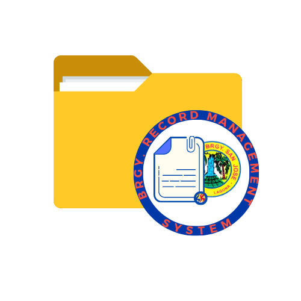
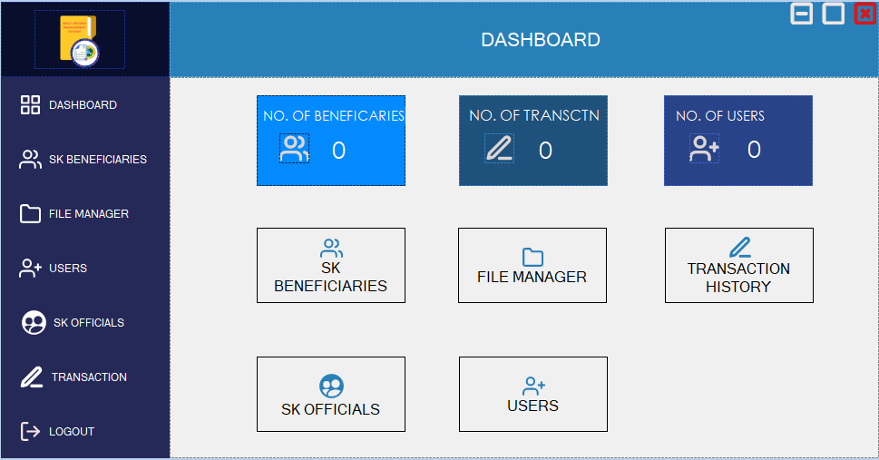
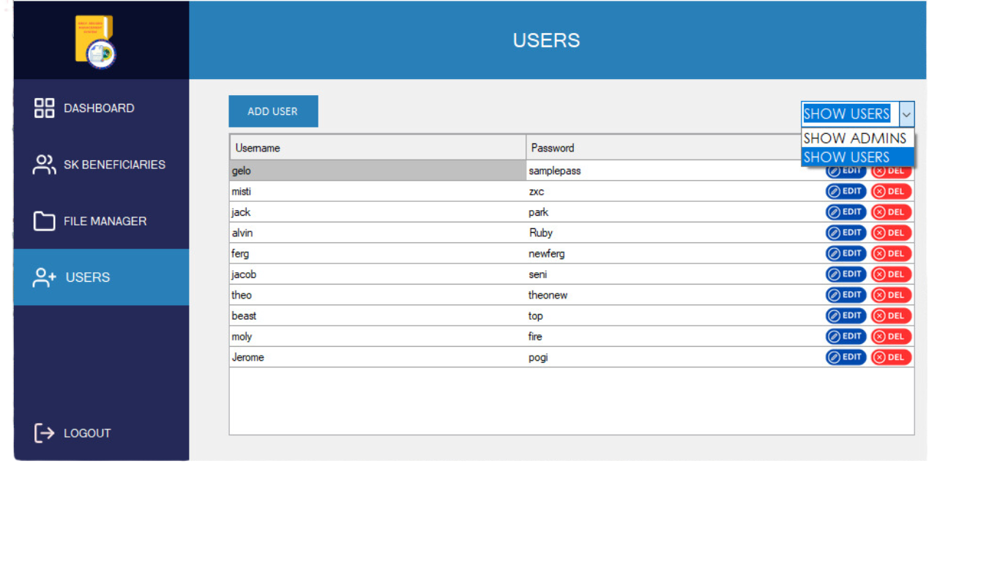
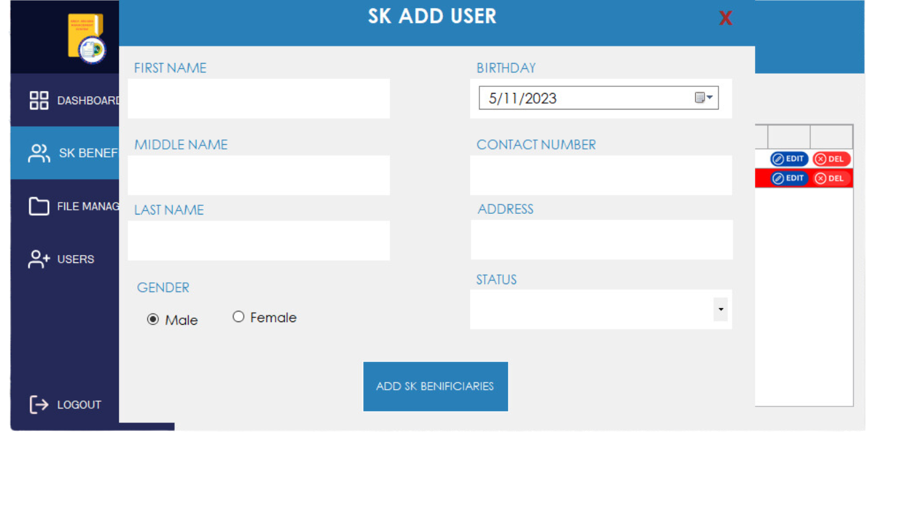

  

# 🏘️ Barangay Record Management System

The **Barangay Record Management System** is a robust **desktop application** built with **C# and WinForms**, backed by a **MySQL database**.  
Designed to streamline administrative tasks at the **barangay (village)** level, this system provides an efficient and user-friendly interface for managing residents, SK (Sangguniang Kabataan) records, and community-related data.

---

## 🖼️ Preview

<table align="center" width="100%">
  <tr>
    <td align="center" colspan="2" width="100%">
      
    </td>
  </tr>
  <tr>
  <td align="center" width="50%" style="padding: 5px;">
      
    </td>
    <td align="center" width="50%" style="padding: 5px;">
      
    </td>
  </tr>
</table>

---

## 🚀 Features

- 💾 **File Saving & Record Keeping** — Securely store and manage digital records within the system.  
- 🧑‍🤝‍🧑 **SK Tracking** — Monitor Sangguniang Kabataan members, and participation records.  
- 🎓 **SK Beneficiaries Management** — Record and manage youth beneficiaries of SK programs and initiatives.  
- 💰 **SK Transactions Management** — Track financial transactions and fund allocations for SK projects.  
- 🔐 **User Authentication** — Secure login system for authorized barangay and SK personnel.  
- 📊 **Reports & Analytics** — Generate and view activity summaries and system reports.  
- 🗂️ **Database Integration** — MySQL-powered backend for reliable and efficient data storage.  

---

## 🛠️ Tech Stack

| Layer | Technology |
|-------|-------------|
| **Frontend** | C# (Windows Forms) |
| **Backend** | MySQL Database |
| **IDE** | Visual Studio |
| **Language** | .NET / C# |
| **Architecture** | Desktop Application (Client-Server) |

